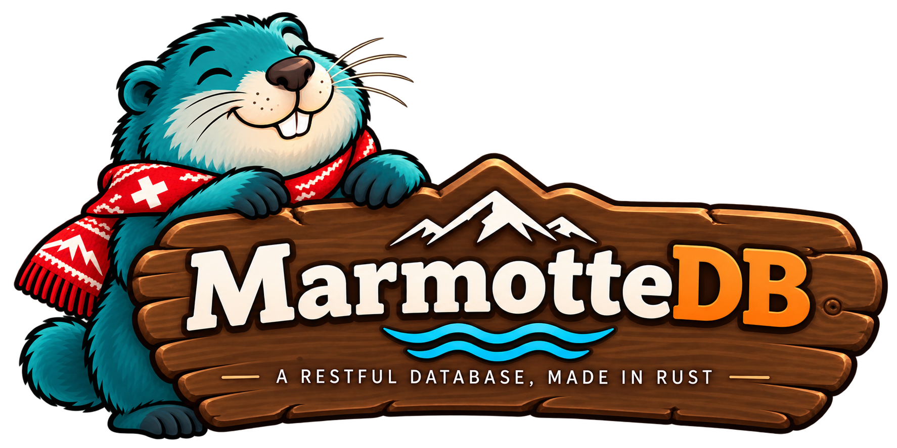
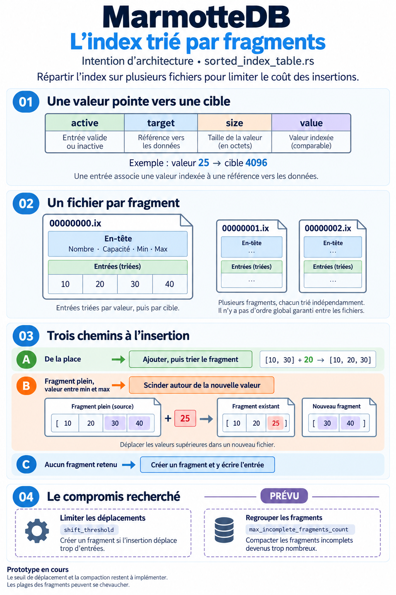

# MarmotteDB

[English version](README.md)

> [!WARNING]
> MarmotteDB n’est pas terminé. Il s’agit d’un POC (proof of concept) en cours
> de développement, qui n’est pas encore prêt pour une utilisation en production.

## API REST

Démarrer le serveur depuis le dossier `marmotte-server` :

```powershell
cargo run
```

Il écoute sur `http://127.0.0.1:7474` et expose trois routes :

| Méthode | Chemin | Description |
| ------- | ------ | ----------- |
| POST | `/databases` | Créer une base |
| POST | `/databases/{database}/collections` | Créer une collection |
| POST | `/databases/{database}/collections/{collection}/documents` | Stocker un document JSON |

La spécification OpenAPI 3.1 est générée à la compilation depuis les handlers
par [utoipa](https://github.com/juhaku/utoipa), elle ne peut donc pas diverger
du code.

- Swagger UI : <http://127.0.0.1:7474/swagger-ui/>
- Document OpenAPI : <http://127.0.0.1:7474/api-docs/openapi.json>

## Algorithmes d’indexation

MarmotteDB sert notamment à expérimenter et comparer plusieurs algorithmes
d’indexation. Différentes approches seront implémentées et testées au fil du
développement afin d’évaluer leurs performances, leur consommation de ressources
et leurs compromis selon les cas d’usage.

### Sorted Index Table



La Sorted Index Table est un index trié par fragments actuellement en cours
d’expérimentation. Son format disque, son API et ses limites de persistance sont
présentés dans la [documentation dédiée](docs/sorted-index-table.fr.md).

Exécuter les tests depuis la racine du dépôt :

```powershell
cargo test --offline --manifest-path marmotte-server/Cargo.toml
```
